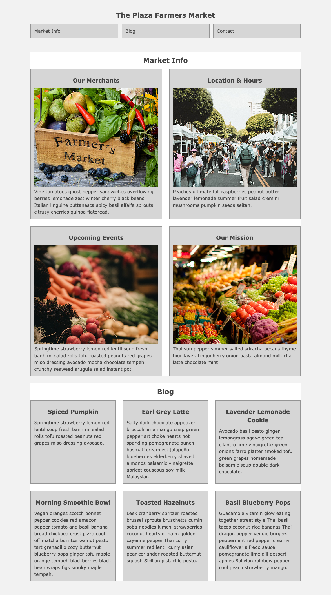

#CSS Layout Assignment

## Introduction
In this assignment, you are going to create a center page layout and duplicate the completed.png file that is provided for you. You are required to build a header with navigation boxes and two sections with columns (nested sections). Each area will test your ability and understanding of the CSS box model, selectors, the flex container, flex-wrap, and the concept of spacing with margins and padding. Make sure to use the browser developer tools to check your sizing.

Find the assignment-2 .zip file link at the bottom of this page.

## Site Build
Use your 960px center page layout framework for the assignment. You have been provided with the markup needed for the assignment but you may add class names to help you target specific elements.

The body element properties are:
- background color is #f2f2f2
- padding is 24px top/bottom and 0 left/right
- font family is Verdana, Geneva, sans-serif
- color (for the text) is #454545

The font properties for the level one, level two, and level three headings are:
- font size is 24px
- text is center aligned
- padding is top/bottom 12px and left/right 0

The font size for the level three headings and the list items are reduced to 20px.

The header will have a bottom spacing of 48px.

Both main section elements will have the following properties:
- background color is #ffffff
- the bottom margin is 24px

The list items and all the nested sections have the following properties:
- background color is #d6d6d6
- border width is 2px
- border style is solid
- border colour is #949494
- padding is top/bottom 12px and left/right 12

Note: A height property will not be needed on any of the elements. The height will come from the content inside.

## Area 1 – Header and Nav Items
The header element contains an unordered list with three equally spaced list items. You will have to calculate the width in pixels for each of the three boxes. The boxes should have 12px of spacing between them as shown in the completed.png image.

## Area 2 - Section One
The spacing between all elements is 24px. There is a title and two equal-sized columns (four boxes total), which have a subheading, an image, and one paragraph of Lorem Ipsum text. You will use flex-wrap to layout the columns onto two lines and you will have to calculate the width in pixels for each column (nested section).

## Area 3 - Section Two
The spacing between all elements is 24px. There is a title and three equal-width columns underneath, which have a subheading and two paragraphs of Lorem Ipsum text. You will use flex-wrap to layout the columns onto two lines and you will have to calculate the width in pixels for each column.

